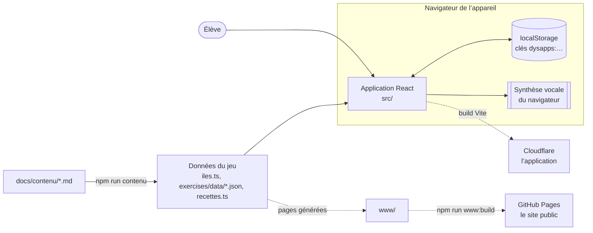
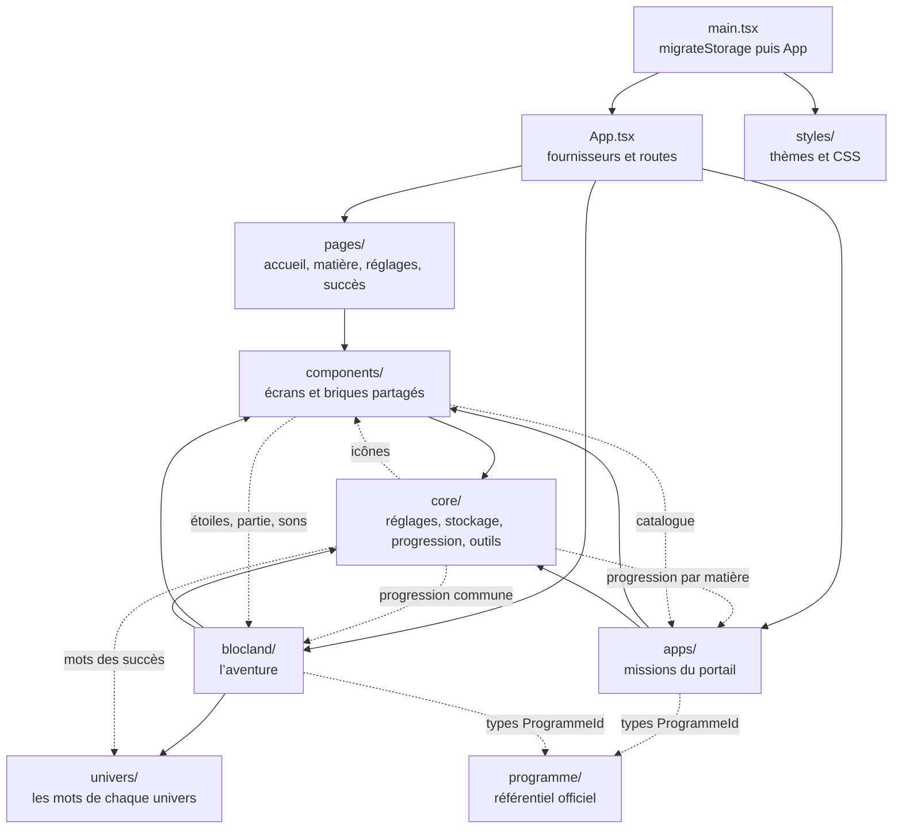
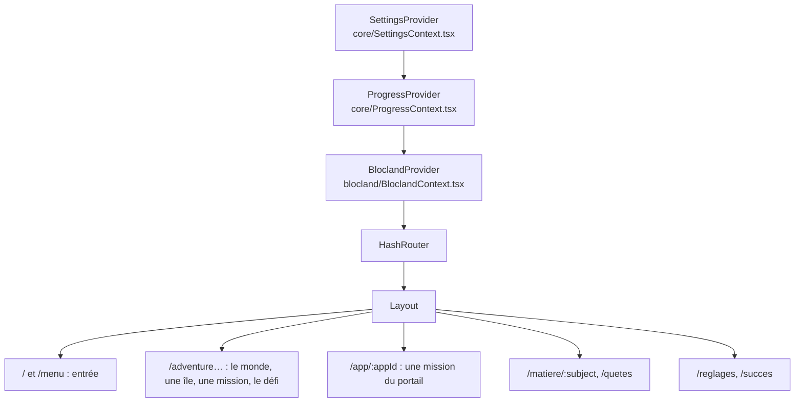
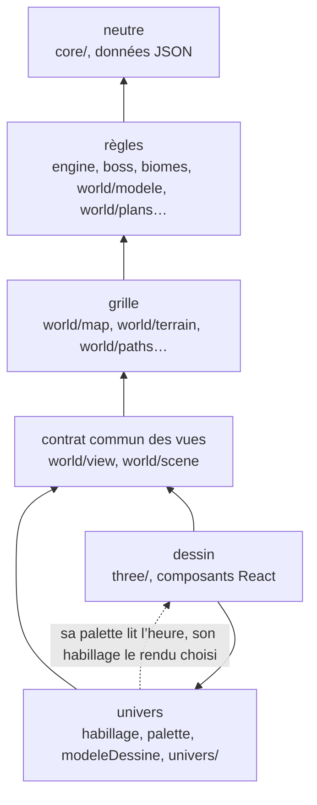

# Architecture

DysApps est une application web statique : React 19, TypeScript, Vite, Three.js pour la 3D, Vitest pour les tests. Aucun serveur, aucune API : tout tourne dans le navigateur et tout est enregistré dans le stockage local de l’appareil.

Ce dossier décrit le code tel qu’il est, avec des schémas :

- cette page : la vue d’ensemble, les dossiers de `src/` et ce qui peut importer quoi ;
- [La partie et sa sauvegarde](partie.md) : l’état du jeu, ce qui le change, comment il s’enregistre et se relit ;
- [Le monde](monde.md) : du modèle du monde au dessin en 3D, les couches et la boucle d’image ;
- [Les fichiers](fichiers.md) : chaque dossier et chaque fichier important, un par un.

La séparation entre le jeu et ses rendus, étape par étape, est décrite dans [Séparer le jeu du rendu](../conception/separation-jeu-rendu.md) ; le format des exercices dans [Exercices](../conception/exercices.md) ; la publication dans [Déploiement](../conception/deploiement.md) ; les règles de code dans [Bonnes pratiques du code](../conception/bonnes-pratiques-code.md).

## Le contexte

Le contenu pédagogique s’écrit en Markdown dans `docs/contenu/` ; `npm run contenu` en produit les données que l’application importe (jamais écrites à la main, la CI le vérifie). Le site public lit les mêmes données pour ses pages générées.

## Les dossiers de `src/`

Une flèche se lit « importe ». Les flèches pleines sont le sens attendu ; les pointillés, les dépendances qui remontent aujourd’hui.

- `core/` : les réglages, le stockage, la sauvegarde aux mots neutres (`migration.ts`), la progression commune, la synthèse vocale, et les petits outils que tout le code partage (`random.ts`, `math.ts`, `color.ts`), qui n’importent rien. Quelques fichiers de `core/` lisent pourtant le jeu : `progress.ts` (les îles et les plans, pour les succès), `subjectProgress.ts` (l’avancée d’une matière, portail et aventure), `univers.ts` et `AppUpdateBanner.tsx` (les icônes de `components/`), `ProgressContext.tsx` (les mots de `univers/`).
- `components/` tient ce que les écrans partagent : la mise en page, l’écran titre, la session de quiz, les boutons de lecture. Plusieurs lisent le jeu : `Layout.tsx` (`useImmersive`), `QuizSession.tsx` et `RecordTag.tsx` (les étoiles, la partie), `TitleScreen.tsx` (la partie, le logo, les sons), `AppBadge.tsx` et `BandeauBatisseur.tsx` (la partie), `SubjectApps.tsx` (le catalogue des missions du portail).
- `apps/` : une mission du portail par dossier, toutes sur `QuizSession` ou `QuestMenu`, déclarées dans `apps/registry.ts`.
- `blocland/` : l’aventure, la plus grosse partie (voir [La partie](partie.md) et [Le monde](monde.md)). Le nom du dossier est historique : il porte le jeu commun aux deux univers.
- `univers/` : les textes propres à chaque univers ; l’habillage du dessin est dans `blocland/world/habillage/`.
- `programme/` : le référentiel des programmes officiels, lu par les tests et le site ; l’application n’en importe que le type des identifiants.

## Les fournisseurs et les routes

Trois contextes, du plus général au plus particulier : les réglages (police, taille, thème, univers), la progression commune (XP, rôles, succès) et la partie de l’aventure. Les adresses sont en `#/…` (`HashRouter`), pour fonctionner sur un hébergement statique. Les anciennes adresses `#/aventure/…` sont traduites par `translatePath` (`core/legacyIds.ts`).

## Les couches du jeu

Le dossier `blocland/` est rangé en couches ; `blocland/world/couches.test.ts` vérifie qu’aucun fichier n’importe une couche qu’il n’a pas le droit de lire.

Une flèche se lit « peut importer » ; une couche peut aussi lire toutes celles que lit la couche qu’elle importe. Les règles ne connaissent ni case ni dessin ; la grille place les choses en cases sans savoir comment on les dessine ; un univers habille le dessin sans changer le jeu. Les trois exceptions d’aujourd’hui sont listées dans le test, chacune avec son motif.

## Les tests

`npm test` lance Vitest (environnement jsdom). Chaque module de logique a son test à côté de lui (`engine.test.ts`, `terrain.test.ts`…). Des tests gardent aussi ce qui ne doit pas bouger sans le vouloir : les couches, le budget de dessin (`world/budget.ts`), les textes de chaque univers (empreintes), la couverture du programme, les données produites depuis `docs/contenu/`, et le rangement du dépôt (`scripts/structure.test.mjs`). Dans un conteneur à la mémoire courte, la suite se lance par dossiers avec `--maxWorkers=2`. La CI passe aussi `npm run lint` (les règles des hooks de React) et `npm run code-mort` (knip : ce que rien n’utilise).
