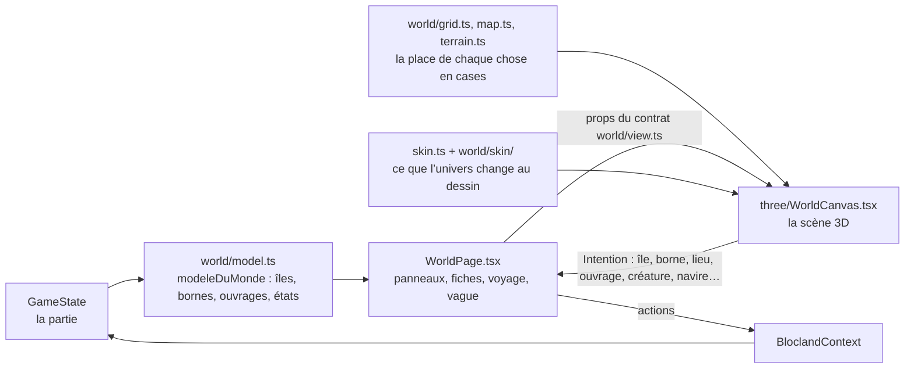
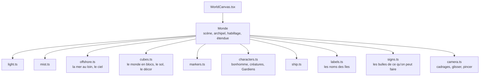
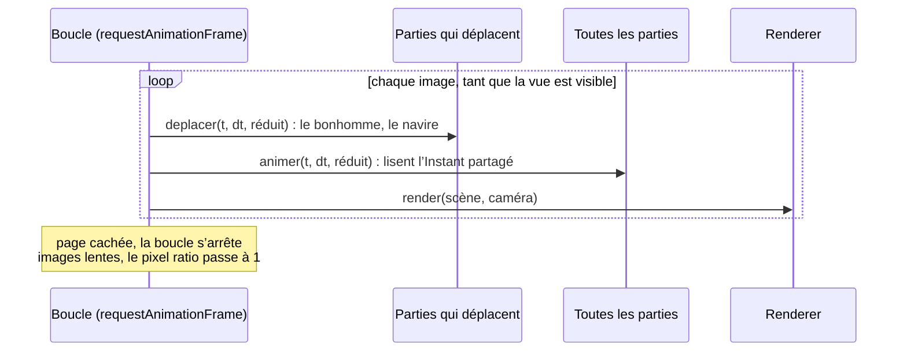

# Le monde

Le monde est la partie la plus lourde du code (`src/game/world/` et `src/game/three/`). Il est rangé pour qu’une même logique serve plusieurs dessins et plusieurs univers : le jeu dit **ce qui existe**, la grille dit **où**, la vue dit **comment le dessiner**. L’histoire de ce rangement est dans [Séparer le jeu du rendu](../conception/separation-jeu-rendu.md) ; le style attendu dans [le rendu](../rendu/style.md).

## Du jeu au dessin

- `world/model.ts` lit la partie et rend le modèle d’un archipel en identifiants, sans une seule case : les îles, leurs bornes et leur état, les ouvrages, le voyage en cours. Il décide aussi ce que fait un toucher (jouer une borne, ouvrir l’île d’un ouvrage, aller vers une île, voyager).
- La grille (`world/map.ts` la forme des îles, `world/terrain.ts` le monde en cubes, un métier par fichier dans `world/terrain/`, `world/paths.ts` la marche, `world/harbour.ts` le quai) place tout en cases du monde ; `world/grid.ts` en est l’entrée (`grilleDe`).
- `world/view.ts` est le contrat entre `WorldPage` et une vue : les props qu’une vue reçoit, les intentions qu’elle renvoie (`world/layout.ts`). `WorldPage` ne connaît que ce contrat.
- La vue ne décide rien : elle dessine ce qu’on lui passe et dit ce que l’élève a touché, par une `Intention` que `WorldPage` traite dans un seul `switch`.

## La scène 3D

`three/WorldCanvas.tsx` crée une scène par archipel, refaite quand l’archipel ou « Réduire les animations » change. La scène est faite de **parties**, chacune dans son fichier, qui suivent le même contrat (`three/scenePart.ts`) : se construire à partir du `Monde`, s’animer à chaque image, se libérer.

- Les parties partagent un `Instant` (où en sont la marche et le voyage à cette image) et les `Derniers` props de la vue : la scène n’est pas refaite quand les props changent, les parties les relisent.
- Le calcul des formes est pur et testé dans `world/` (`landMesh.ts` le sol en facettes, `construction.ts` les bâtiments, chacun avec ses réglages, ses couleurs et son éclairage rangés à côté, dans `landMesh/` et `construction/`, `decorMesh.ts` le décor, `sea.ts`, `fauna.ts`, `characters/`) ; `three/` ne fait que les donner à Three.js.
- Chaque géométrie, matériau et texture est libéré quand la scène est refaite (`dispose`).

## Les univers

Les deux univers jouent le même jeu. Ce qui change au dessin passe par un objet `Habillage` (`game/skin.ts`, une donnée par univers dans `world/skin/`) : le ciel, la brume, le sol, les personnages, les étiquettes, les bulles. Ce qui change aux mots passe par `src/universes/` (`useTextes()`). Le code ne teste presque jamais le nom de l’univers : il lit une ligne de l’habillage ou un texte.

## Le budget de dessin

`world/budget.ts` fixe le budget d’un archipel tout construit et compte, sans Three.js, les triangles et les appels de dessin de chaque poste (sol, mer, décor, constructions, personnages…). Un test garde la somme sous le budget ; `npm run rendu:mesures` mesure la scène réelle dans Chromium, et `?mesures` l’affiche dans l’application. Un changement de code qui ne doit rien changer à l’image garde ces nombres à l’identique.
