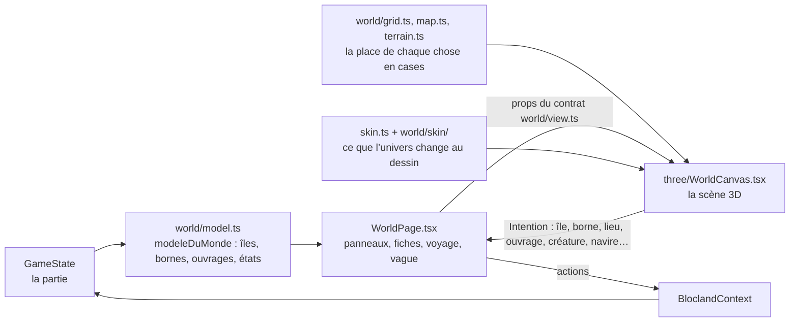
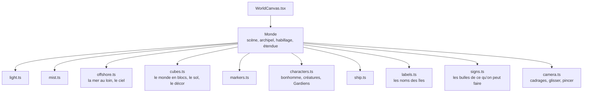
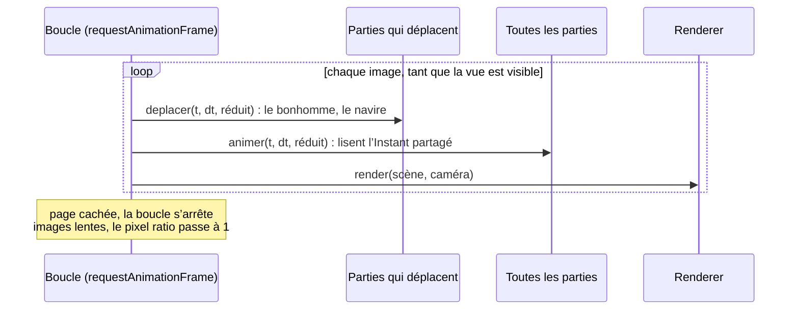

# Le monde

Le monde est la partie la plus lourde du code (`src/game/world/` et `src/game/three/`). Il est rangé pour qu’une même logique serve plusieurs dessins et plusieurs univers : le jeu dit **ce qui existe**, la grille dit **où**, la vue dit **comment le dessiner**. L’histoire de ce rangement est dans [Séparer le jeu du rendu](../conception/separation-jeu-rendu.md) ; le style attendu dans [le rendu](../rendu/style.md).

## Du jeu au dessin

- `world/model.ts` lit la partie et rend le modèle d’un archipel en identifiants, sans une seule case : les îles, leurs bornes et leur état, les ouvrages, le voyage en cours. Il décide aussi ce que fait un toucher (jouer une borne, ouvrir l’île d’un ouvrage, aller vers une île, voyager).
- La grille (`world/map.ts` la forme des îles, `world/terrain.ts` le monde en cubes, un métier par fichier dans `world/terrain/`, `world/paths.ts` la marche, `world/harbor.ts` le quai) place tout en cases du monde ; `world/grid.ts` en est l’entrée (`grilleDe`).
- La place des lieux dans leur région (GD-9) : `world/placement.ts` garde la pose de chaque lieu (son origine dans le monde et un quart de tour, `placeIslands` ; sans pose, la carte de départ de `map.ts`) et la géométrie d’un quart de tour. Chaque lieu tire son dessin (côte, relief, décor, îlot du Gardien, lacs, cascades, marges, et les amorces de ses ouvrages que le décor laisse libres, `amorcesDuDessin`) une fois pour toutes dans son repère (`IslandDef.repere`, sa place sur la carte de départ) : posé ailleurs, il garde exactement son dessin ; tourné, tout tourne d’un bloc avec lui (cubes, emprise, bornes, portes, îlot, Gardien, créature, et la vue du lieu, `viewYaw` + quarts × 90°). `world/footprint.ts` donne le cadre fixe de chaque région, l’emprise d’un lieu (sa terre, son îlot, ses grandes constructions, le quai) et les écarts ; `world/routing.ts` trace les liaisons (droites ou en L à un seul coude sur l’eau, d’une arrivée sur la côte, au pas de la grille du monde, à une autre ; 96 cases au plus ; une arrivée n’est possible que sur une côte libre d’où le bonhomme gagne le cœur du lieu à pied) et dit si une place est possible (`spotPossible`) ; `world/savedLayout.ts` lit le champ facultatif `world.layout` de la sauvegarde (sa forme ; qu’il tienne sur la grille, `posesOfLayout`, Gardiens déplacés compris). `world/appliedLayout.ts` pose cette disposition sur le monde (`applyLayout` : les lieux à leur place, les liaisons à reposer hors du dessin, les arrivées choisies données au traceur), appelé par `BloclandContext` à la lecture de la partie et à chaque changement de `world.layout` ; son numéro (`disposition`, `layoutVersion`) refait la scène 3D et les cadrages qui lisent la place des lieux, et chaque cache de la disposition (`layoutCache`) se vide. Les grandes constructions au large suivent leur lieu (`monumentIslet`). Le cœur du mode « Aménager » : `world/arrange.ts` les actions pures sur le monde d’une partie (déplacer un lieu à une place libre, le calage sur la plus proche d’un point touché, la suivante dans une direction, tourner un lieu, l’îlot et l’orientation d’un Gardien, une borne dans la bande de devant, une arrivée ; les liaisons qui ne tiennent plus deviennent « à reposer », `relinkBetween` les repose ; `backToStartingMap`), `world/arrangeSession.ts` « Remettre comme avant » et ↶ (un instantané à l’entrée, une pile des poses), `world/placeSentence.ts` la place d’un lieu en signes (`placeSigns` : le voisin, l’une des huit directions et sa flèche, l’écart en cases) et en mots (« au nord de la Forêt des sons, à 2 cases »), comme on la voit sur la Carte : le nord en haut, l’est à droite de l’écran, du côté des x du monde qui descendent (les flèches du mode, `DIRECTION_STEP`, suivent le même sens ; `three/arrangeDirections.test.ts` le vérifie sur la projection de la caméra de la Carte). Les mots du mode et du menu nomment une liaison avec le mot de l’univers (« ouvrage », `world/linkWord.ts`). Le Gardien et les bornes déplacés se dessinent à leur place (`placeFixtures` de `placement.ts`, `chosenGuardian`, `chosenStation`) : l’îlot, son passage et la bande réservée suivent, le décor qui évite les bornes lit leur vraie place (`questStations` ; la place de départ, `startingStations`). Une île posée sur des écueils les cache, avec une case d’eau de marge (`visibleReefs` de `terrain/sea.ts`), sans changer la mer tirée ni la carte de départ. L’écran du mode : `world/arrangeMode.ts` (le choix et ses gestes, les phrases), `world/arrangeView.ts` (ce que montre le choix, en cases du monde), `world/arrangeHandles.ts` (les poignées, les flèches et « Tourner », sur l’eau autour du choix ; leur dessin, `three/arrangeHandles.ts`), `world/arrangeGesture.ts` (le temps du geste), `three/arrange.ts` (leur dessin ; les types de ce qu’elle reçoit, `ArrangeView` et `ArrangeGesture`, sont dans le contrat des vues, `world/view.ts`), `Arranging.tsx` (l’état du mode), `ArrangeBar.tsx` (l’écran) et `ArrangeList.tsx` (la vue simple, aussi dans le panneau « Aménager la carte » au téléphone en grand texte). Pendant le mode, la vue renvoie deux intentions de plus : `mer` (le point touché sur l’eau) et `ouvrage` avec son point (l’arrivée la plus proche).
- Les liaisons posées (GD-9) : `world/linkGeometry.ts` est la couche de grille qui donne leur géométrie aux règles (`provideLinkGeometry`, inversion de dépendance : `world/archipelago.ts` ne connaît ni la carte ni le traceur). Il tient les liaisons posées de la partie (`poserLesLiaisons`, appelé par `BloclandContext` et par `worldCubes`), trace celles d’une région dans leur ordre (`linkRoute`), dit la nature d’une liaison (`linkKind` : sentier, pont jusqu’à 36 cases, bac au-delà) et les voisins d’un lieu (`neighboursOf`, ce qu’un pont relierait : la vue d’un lieu les cadre avec lui). Le monde (`world/terrain/links.ts`) dessine les liaisons posées, plus le fantôme de celle qui ouvre chaque lieu fermé ; une liaison posée que le traceur ne refait pas prend le tracé qu’elle aurait seule (`traceDeRepli`), à défaut son tracé d’origine. `src/main.tsx` et `src/setupTests.ts` importent ce module au démarrage : sans lui, les règles n’ont pas de géométrie.
- La réunion de deux lieux (GD-9, point 10) : `world/join.ts` calcule, sans Three.js, la forme de la construction qui réunit deux lieux posés au plus près (`joinShape` : le côté commun, au moins 4 cases ; les cases sur l’eau entre leurs côtes, jusqu’à 2 cases dans une baie ; les marches, trois au plus) et son plan (`joinPlan`, une `PlanDef` de zone `join`, `join.<lieu>.<lieu>`, dont les clés restent dans le repère de la paire : la paire bouge et tourne sans rien perdre). `appliedJoins` lit les paires de la disposition appliquée (`placeJoins`, `world/placement.ts`) ; `world/arrange.ts` réunit (`joinIslands`), bouge et tourne la paire d’un bloc (`groupAt`) ; le traceur (`routing.ts`) tient les liaisons au large de la zone de la réunion ; `world/terrain/joins.ts` en tire les cubes (digue d’herbe, ou jetée de pierre dans Archipéo), touchables comme un monument (`place` `monument:join.…`) ; `avatarRoute` passe dessus. À l’écran, `Joins.tsx` (panneau, page, ligne dans le panneau du lieu) et `useJoinBuilder` (`useMonumentBuilder.ts`, la pose case par case partagée avec les monuments).
- `world/view.ts` est le contrat entre `WorldPage` et une vue : les props qu’une vue reçoit, les intentions qu’elle renvoie (`world/layout.ts`). `WorldPage` ne connaît que ce contrat.
- La vue ne décide rien : elle dessine ce qu’on lui passe et dit ce que l’élève a touché, par une `Intention` que `WorldPage` traite dans un seul `switch`.

## La scène 3D

`three/WorldCanvas.tsx` crée une scène par archipel, refaite quand l’archipel ou « Réduire les animations » change. La scène est faite de **parties**, chacune dans son fichier, qui suivent le même contrat (`three/scenePart.ts`) : se construire à partir du `Monde`, s’animer à chaque image, se libérer.

- Les parties partagent un `Instant` (où en sont la marche et le voyage à cette image) et les `Derniers` props de la vue : la scène n’est pas refaite quand les props changent, les parties les relisent.
- Le calcul des formes est pur et testé dans `world/` (`landMesh.ts` le sol en facettes, `construction.ts` les bâtiments, chacun avec ses réglages, ses couleurs et son éclairage rangés à côté, dans `landMesh/` et `construction/`, `decorMesh.ts` le décor, `sea.ts`, `fauna.ts`, `characters/`) ; `three/` ne fait que les donner à Three.js.
- Chaque géométrie, matériau et texture est libéré quand la scène est refaite (`dispose`).

## Les univers

Les deux univers jouent le même jeu. Ce qui change au dessin passe par un objet `Habillage` (`game/skin.ts`, une donnée par univers dans `world/skin/`) : le ciel, la brume, le sol, les personnages, les étiquettes, les bulles. Ce qui change aux mots passe par `src/universes/` (`useTextes()`). Le code ne teste presque jamais le nom de l’univers : il lit une ligne de l’habillage ou un texte.

## Le budget de dessin

`world/budget.ts` fixe le budget d’un archipel tout construit (`renderBudgetOf` : 60 000 triangles et 40 appels pour les tablettes, relevés le 6 octobre 2026 à 63 400 triangles aux Premiers Rivages, `RENDER_BUDGET_6E`, pour les îles d’histoire-géographie de HG-2, et à 62 900 dans les trois autres archipels, `RENDER_BUDGET_AUTRES`, pour les six de HG-3) et compte, sans Three.js, les triangles et les appels de dessin de chaque poste (sol, mer, décor, constructions, personnages…). Un test garde la somme sous le budget ; pour Blocland, le plafond du monde en blocs (`PLAFOND_DU_MONDE_EN_BLOCS`, 88 000 triangles et 240 appels depuis GD-9, 100 000 et 256 depuis le 6 octobre 2026 pour les deux îles d’histoire-géographie du 6e ; les six des 5e, 4e et 3e, HG-3, y tiennent : 79 564 triangles et 228 appels au pire, aux Îles Brumeuses) tient aussi au pire d’une région aménagée (`worstCaseOfRegion` : une réunion par paire de lieux au plus, les autres liaisons au plus long ou en raccourci, la somme bornée par un graphe planaire, 3n − 6 ; `joinTriangles` compte la plus large réunion possible de la région ; et le dessin d’un choix du mode « Aménager », `arrangeViewCost`) ; `npm run rendu:mesures` mesure la scène réelle dans Chromium, et `?mesures` l’affiche dans l’application. Un changement de code qui ne doit rien changer à l’image garde ces nombres à l’identique.
