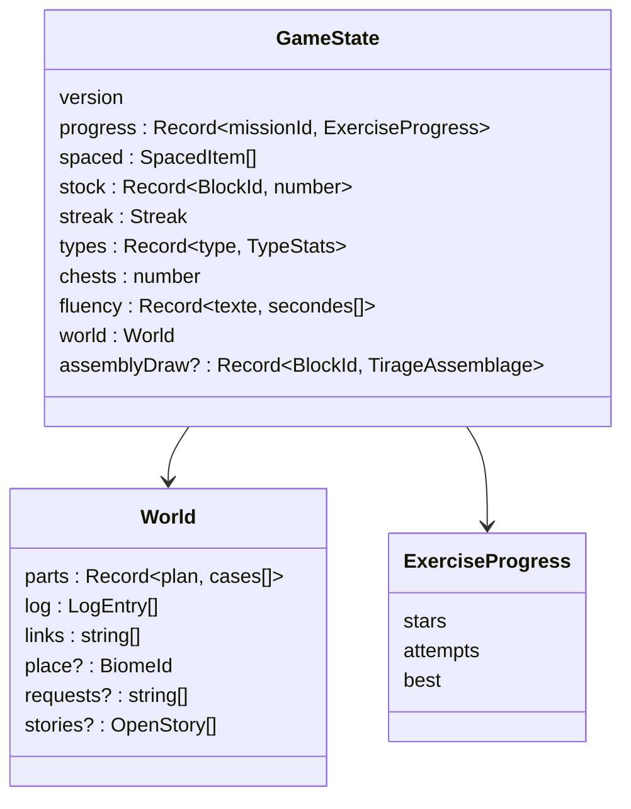
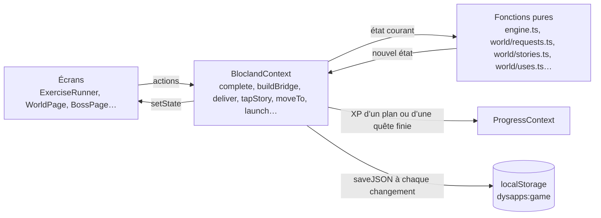
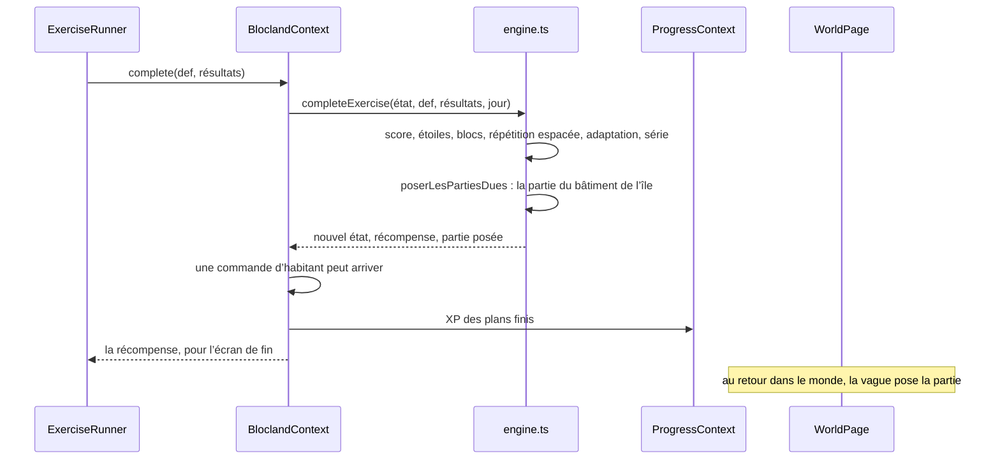
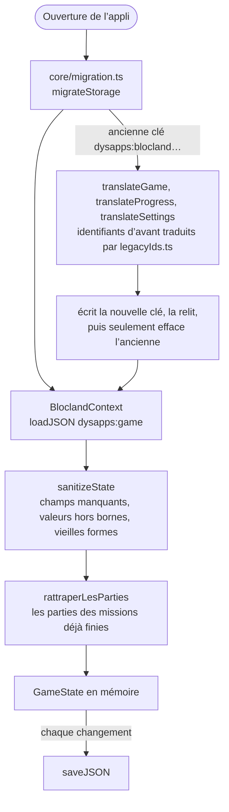

# La partie et sa sauvegarde

La partie de l’aventure est un seul objet, `GameState` (`src/game/engine/state.ts`, réexporté par `engine.ts`), que des fonctions pures transforment et que `BloclandContext.tsx` tient en mémoire et enregistre. Les règles du jeu sont décrites dans [le jeu](../gameplay/index.md) ; cette page dit où elles vivent dans le code.

## L’état

- `progress` : par mission, les meilleures étoiles, le nombre d’essais et le meilleur score.
- `spaced` : les items à revoir (répétition espacée) ; `types` : l’adaptation du niveau par type d’exercice ; `streak` et `chests` : la série de jours et ses coffres ; `fluency` : les temps de lecture.
- `stock` : les blocs gagnés, la ressource du jeu.
- `world` : les cases posées de chaque plan, le journal des bâtiments finis, les liaisons construites, l’île du bonhomme, les commandes des habitants arrivées et les quêtes ouvertes avec leur étape (GD-10 ; une quête finie en sort, son objet posé dans `parts`).

La progression commune (XP, rôles, succès), partagée avec le portail, est à part : `core/progress.ts`, tenue par `core/ProgressContext.tsx`.

## Qui change l’état

Les écrans ne modifient jamais l’état eux-mêmes : ils appellent une action du contexte, qui passe l’état courant à une fonction pure et garde ce qu’elle rend. Les fonctions pures (`completeExercise`, `buildBridge`, `launchVehicle`, `fillPlanCell`, `repondreAssemblage`…) se testent sans React.

## La fin d’une mission

## L’ouverture et l’enregistrement

- Une sauvegarde n’est jamais perdue : une vieille forme est traduite en avant, jamais effacée avant que la nouvelle soit écrite et relue. Un refus d’écrire (stockage plein) laisse l’ancienne.
- `core/storage.ts` range tout sous le préfixe `dysapps:` et peut geler la sauvegarde : plus rien ne s’écrit jusqu’au prochain chargement de la page. La sauvegarde dans un fichier et sa restauration sont dans `core/saveFile.ts`.
- Une partie d’avant le format 4 suit les exercices déplacés par les programmes de 2025-2026 (`core/movedIds.ts`) ; ses défis ouverts avant le déplacement sont lus à ce moment-là, sur la progression d’avant (`core/movedChallenges.ts`), et gardés dans `world.challengesKeptOpen`. Les parties dues se rattrapent même sur un lieu fermé : le monde ne dessine les bâtiments que des lieux ouverts.
- Le détail des clés et des traductions est dans [Les fichiers](fichiers.md#le-socle-commun-srccore).
